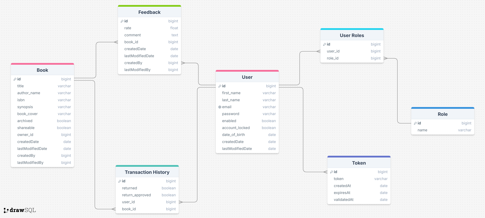

# Book Social Network API

## Overview

The Book Social Network API is a RESTful service designed to manage a community of book enthusiasts. It enables users to manage their book collections, share books with others, and borrow or return books within the community. The API provides secure authentication, role-based access, and detailed book management functionality, along with additional features like email verification, password reset, caching, and swagger documentation.

## Features

- User Management

  - Secure user registration and login.
  - Role based access

- Book Management

  - Create, update, archive, and share books with the community.
  - View available books and details of individual books.

- Borrow and Return Books

  - Borrow a book if it's available and not currently archived.
  - Return borrowed books.
  - Track borrowing history

- Approve Book Return

  - Book owners can approve book returns, ensuring proper management of the borrowing system.

- Book Feedback

  - Users can leave feedback for books they’ve borrowed.

## Advanced Features

- JWT Authentication

  - The API uses JSON Web Tokens (JWT) for secure, stateless authentication to protect resources and endpoints.
  - Tokens have expiration for enhanced security.

- Email Verification

  - Sends a verification email after user registration to confirm the email address.

- Password Reset via OTP

  - Enables users to reset forgotten passwords by sending a One-Time Password (OTP) via email.

- Book Cover Upload

  - Allows users to upload book cover images when adding or updating a book’s details.

- Caching with Caffeine

  - Integrates Caffeine caching to improve performance and reduce database load by caching frequently accessed resources.

- Swagger Documentation:

  - Provides comprehensive API documentation using Swagger, allowing users to explore and test the API endpoints.

## Docker and Docker Compose

- The project includes Docker and Docker Compose configuration for easy deployment and management.
- All services, including the Spring Boot application and PostgreSQL database, can be run in containers.

## Database Schema and Entities

The API uses PostgreSQL as the database. The main entities include:

**User** Manages user data, authentication, and email verification status.

**Role** represets the user roles.

**Token** represets the otp token.

**Book** represents books in the system with details such as title, author, and cover image.

**BorrowTransactionHistory** Tracks borrowing records, including borrow and return dates.

**Feedback** Stores user feedback for borrowed books.



## API Endpoints

- All endpoints start with `/api/v1`

### User Management

- `POST /auth/register`: Register a new user and send a verification email.
- `POST /auth/login`: Login a user and return a JWT.
- `GET /auth/activate`: Activate user's email address.
- `POST /auth/forgot-password`: Send an OTP for password reset.
- `PATCH /auth/reset-password`: Reset password with the OTP.

### Book Management

- `GET /books`: List all available books.
- `POST /books`: Create a new book.
- `GET /books/{book-id}`: Find a book by its ID.
- `PATCH /books/archived/{book-id}`: Update the archived status of a book.
- `POST /books/borrow/{book-id}`: Borrow a book.
- `PATCH /books/borrow/return/{book-id}`: Return a borrowed book.
- `PATCH /books/borrow/return/approve/{book-id}`: Approve the return of a borrowed book (Owner).
- `GET /books/borrowed`: Find all borrowed books.
- `POST /books/cover/{book-id}`: Upload a book cover.
- `GET /books/owner`: List all books owned by a specific user.
- `GET /books/returned`: Find all returned books.
- `PATCH /books/shareable/{book-id}`: Update the shareable status of a book.

### Feedback

- `POST /feedbacks`: Create new feedback for a book.
- `GET /feedbacks/book/{book-id}`: Find all feedback for a specific book.

### Swagger Documentation

- `GET /swagger-ui/index.html`: Access the Swagger UI for exploring and testing API endpoints.

## Technologies Used

- **Spring Boot 3** for the core application.
- **Spring Security 6** for authentication and authorization.
- **JWT** for token-based security.
- **PostgreSQL** for the database.
- **Caffeine** for caching.
- **Swagger** for API documentation.
- **JavaMailSender** for sending emails (verification and password reset).
- **Docker** and **Docker Compose** for containerization.

## Getting Started

### Prerequisites

- Java 17 or higher.
- Docker and Docker Compose installed.
- Maven for dependency management.

### Installation

1. Clone the repository:

```bash
git clone https://github.com/MohamedAbotalb/Book_Social_Network.git
cd Book_Social_Network
```

2. Update the environment variables in the application.yml file with your database and email configurations:

```yaml
spring:
  datasource:
    url: jdbc:postgresql://db:5432/book_db
    username: your_db_username
    password: your_db_password

  mail:
    host: localhost
    port: 1025
    username: username
    password: password
    properties:
      mail:
        smtp:
          trust: '*'
        auth: true
        starttls:
          enable: true
        connectiontimeout: 5000
        timeout: 3000
        writetimeout: 5000
```

3. Run the application using Docker Compose:

```bash
docker-compose up --build
```

4. Access the API documentation at:

```bash
http://localhost:8088/api/v1/swagger-ui/index.html
```

## Resources

- [Book Social Network App](https://www.youtube.com/watch?v=WuPa_XoWlJU&pp=ygUTYm9vayBzb2NpYWwgbmV0d29yaw%3D%3D)
- [Spring Boot Cache](https://medium.com/@geonikpal/spring-boot-cache-18ab22a09f42)
- [Implement JWT authentication in a Spring Boot 3 application](https://medium.com/@tericcabrel/implement-jwt-authentication-in-a-spring-boot-3-application-5839e4fd8fac)
- [Using Docker Compose with Spring Boot and PostgreSQL](https://devcracker.medium.com/how-to-add-a-link-or-hyperlink-in-readme-md-file-68752bb6499e)
- [Documenting a Spring REST API Using OpenAPI 3.0](https://www.baeldung.com/spring-rest-openapi-documentation)
